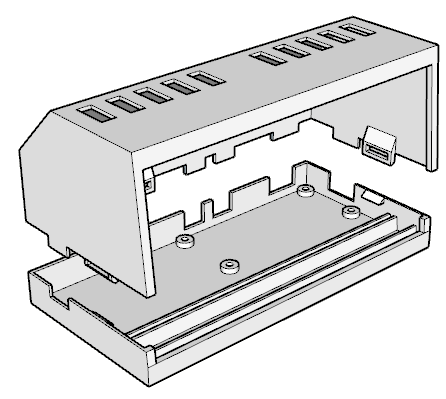
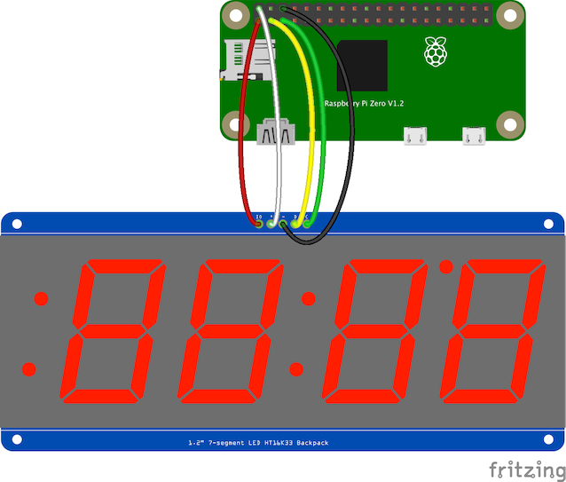
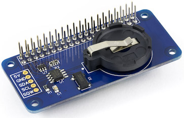
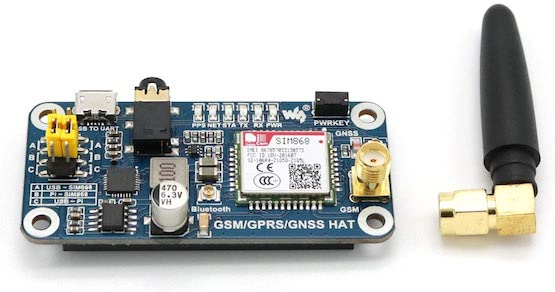

# Raspberry PI Zero WiFi-NTP 7-Segment Desktop Clock

Simple WiFi NTP desktop clock with a large 7-segment display. Built on Raspberry PI Zero.



With LED dot NTP synchronization indicator...

## Why?

* Computers and mobile devices have been using NTP, GSM/GPRS, GPS/GNSS to synchronize time for decades. Desktop / wall and alarm clocks still live in 19th century.
* Changing time twice a year due to retarded DST sucks ass.
* I want to have an indication to see if the time is accurate (synchronized) or not.
* Maybe I want to have Stratum 1 desktop clock.

## Hardware BOM
* [Raspberry PI Zero with WiFi and GPIO Headers](https://www.raspberrypi.org/products/raspberry-pi-zero/)
* [Adafruit 1.2" 7-Segment Display with I2C Backpack](https://www.adafruit.com/product/1270)
* Breadboard Wires
* Optional [Abelectronics RTC Pi Backup Hat](https://www.abelectronics.co.uk/p/70/rtc-pi)
* Optional [Adafruit VEML7700 Lux Sensor](https://www.adafruit.com/product/4162)
* USB power supply and cable
* Case, either 3D printed or make your own
* [Screen](https://www.tapplastics.com/product/plastics/cut_to_size_plastic/acrylic_sheets_transparent_colors/519), Size: 120 x 50 x 3mm

## Building the hardware

### Wiring GPIO to Adafruit Segment Display I2C
* RPi `3.3V` to 7-Segment Display `IO` (V_IO)
* RPi `5V` to 7-Segment Display `+` (+5V)
* RPi `GND` to 7-Segment Display `-` (GND)
* RPi `SCL` to 7-Segment Display `C` (SCL) 
* RPi `SDA` to 7-Segment Display `D` (SDA)



### Optional RTC Backup Battery Hat

RTC is not required and almost never used while using NTP. However in case of power loss AND internet/wifi/router not being up before Raspberry PI boots, you will get time from *fake-hwclock*, which is no use. RTC backup will make your time accurate in this rare circumstance.



There are many RTC backup modules available on the market, [this one](https://www.abelectronics.co.uk/p/70/rtc-pi) is Pi Zero sized.

Install RTC Hat between PI GPIO and wires going to the display. Make sure you install the coin battery before powering it on. The vendor warns that operation without battery will damage the board. Follow instructions below for software setup.

### Advanced - GSM/GPRS/GPS/GNSS Hat



A complete overkill but you can also get time from:

* GSM tower via [NITZ](https://en.wikipedia.org/wiki/NITZ) (no paid subscription required)
* GSM network location (CLBS / CIPGSMLOC)
* GPRS network location (AGPS)
* GNSS/GPS/COMPASS/etc. GPS based time

You can use one of [these hats](https://www.amazon.com/gp/product/B076CPX4NN/) or similar. [MAX-M8Q](https://www.waveshare.com/max-m8q-gnss-hat.htm) has passthrough GPIO and awesome Raspberry PI and [NTP setup instructions](https://www.waveshare.com/wiki/MAX-M8Q_GNSS_HAT).

GSM/GPRS time penetrates buildings like normal cell phone. GPS requires an open sky access but is less dependent on ground infrastructure.

### Light sensor

Rpiclock is set to change brightness based on time of day. A more advanced case would be to use a I2C based Lux sensor to measure ambient light and change display brightness based on input from the sensor. Example sensor [VEML7700](https://www.adafruit.com/product/4162).

### Case


Download and 3D Print [rpiclock.stl](rpiclock.stl) or design your own case.

## Software configuration

### OS

- Linux. The ubiquitous [Raspberry Pi OS](https://www.raspberrypi.org/software/operating-systems/) (formerly Raspbian) is quite of a bloat and slow to boot but otherwise works pretty well. Disable wait for network to speed up boot. Faster options are [Alpine](https://www.alpinelinux.org/), [piCore](http://www.tinycorelinux.net/13.x/armv6/releases/RPi/) or [instant-pi](https://github.com/IronOxidizer/instant-pi). [DietPi](https://dietpi.com/) despite promising name is actually quite slow to boot, likely due to Pigbian base.

- FreeBSD - maybe. Super slow to boot and no wlan support on rpi zero.

- NetBSD - no wlan support.

- Plan 9 - https://periph.io/ is not supported

### Power

Check if Raspberry PI is not experiencing low voltage. You can run `vcgencmd get_throttled`, it should return `0x0`.

### I2C Interface

Make sure I2C interface is enabled. On Raspbian this is done using `raspi-config` under `Interface Options`. Run `i2cdetect -y 1`. It should show value `70` on position `70`.

### WiFi, Locale, Timezone, DST, etc.

Make sure to configure WiFi, Locale, Timezone and DST. On Raspbian this is done using `raspi-config`.

### NTP

A real NTP daemon supporting RFC5905 is required to be able to get leap indicator and show whether the clock is synchronised or not. You can still use rpiclock without NTP but it will not show the status.

```shell
$ apt install ntp
```

### RTC hwclock (optional)

Skip this if not using an RTC HAT.

RTC/hwclock also depends on which OS you are using. Following instructions are for Raspbian:

```shell
$ sudo apt install i2c-tools
$ sudo apt remove fake-hwclock
$ sudo echo dtoverlay=i2c-rtc,ds1307 >> /boot/config.txt
$ sudo echo rtc-ds1307 >> /etc/modules
$ sudo echo '5 *  *  * * *    root   /sbin/hwclock -w' >> /etc/crontab
```

Edit `/lib/udev/hwclock-set`, remove following lines:

```
if [ -e /run/systemd/system ] ; then
  exit 0
fi
```

Reboot, check if hwclock works:

```shell
$ i2cdetect -y 1
```

should show `UU` on position `68`.

```shell
$ sudo hwclock -r
$ sudo hwclock -w
```


### Clock Service Install

Download the binary from [Releases](https://github.com/tenox7/rpiclock/releases).

If using `systemd` Download [Service File](https://raw.githubusercontent.com/tenox7/rpiclock/main/rpiclock.service) and move in to `~/.config/systemd/user/rpiclock.service`. Make sure the right path to the binary is specified.

```shell
$ loginctl enable-linger $USER
$ systemctl --user daemon-reload
$ systemctl --user enable --now rpiclock.service
```

## References
* [Adafruit Wiring and Setup](https://learn.adafruit.com/adafruit-led-backpack/python-wiring-and-setup-d74df15e-c55c-487a-acce-a905497ef9db)
* [RTC Pi setup on RPI OS](https://www.abelectronics.co.uk/kb/article/30/rtc-pi-on-a-raspberry-pi-raspbian-jessie)
* [HT16K33 Golang Library](https://github.com/rafalop/sevensegment)

## Legal

* This is not an officially supported Google product.
* Copyright &copy; 2021-2023 Google LLC
