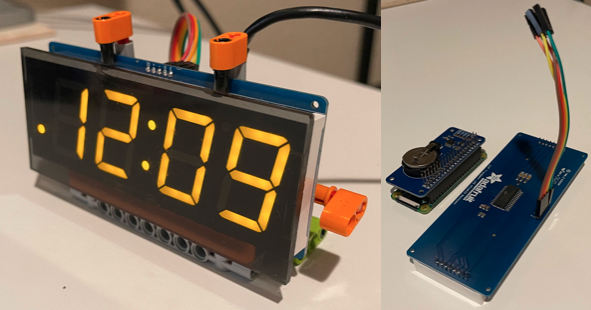

# Raspberry PI Zero WiFi-NTP 7-Segment Desktop Clock

Simple WiFi NTP desktop clock with a large 7-segment display. Built on Raspberry PI Zero.



With LED dot NTP synchronization indicator...

## Why?

* Computers and mobile devices have been using NTP, GSM/GPRS, GPS/GNSS to sync time for decades. Desktop, wall and alarm clocks still live in 19th century.
* Changing time twice a year due to retarded DST sucks ass.
* I want to know exact time including whether it's actually synchronized or not.

## Hardware BOM
* [Raspberry PI Zero with WiFi and GPIO Headers](https://www.raspberrypi.org/products/raspberry-pi-zero/)
* [Adafruit 1.2" 7-Segment Display with I2C Backpack](https://www.adafruit.com/product/1270)
* Breadboard Wires
* Optional [RTC Pi Hat](https://www.abelectronics.co.uk/p/70/rtc-pi)
* USB power supply and cable
* Case TBD
* [Screen](https://www.tapplastics.com/product/plastics/cut_to_size_plastic/acrylic_sheets_transparent_colors/519)

## Building the hardware

### Wiring GPIO to Adafruit Segment Display I2C
* RPi 3.3V to 7-Segment Display `IO` (V_IO)
* RPi 5V to 7-Segment Display `+` (+5V)
* RPi GND to 7-Segment Display `-` (GND)
* RPi SCL to 7-Segment Display `C` (SCL) 
* RPi SDA to 7-Segment Display `D` (SDA)


### Optional RTC Hat

RTC is not strictly required and technically very rarely used while utilizing NTP. However in a case of power loss, your and internet/wifi not being online before Raspberry PI comes up, you will get time from fake-hwclock, which is no use. RTC will make your time accurate in this case.


Install RTC Hat between PI GPIO and wires going to Adafruit. Make sure you install the coin battery before powering it on. The vendor warns that operation without battery will damage the board. Follow instructions below for software setup.

### Advanced - GSM/GPRS/GPS Hat

A complete overkill but you can also get time from:

* GSM tower (no subscription required) via [NITZ](https://en.wikipedia.org/wiki/NITZ)
* GSM network location (CLBS / CIPGSMLOC)
* GPRS network location (AGPS)
* GNSS/GPS/COMPASS/etc. GPS based time

You can use one of [these hats](https://www.amazon.com/gp/product/B076CPX4NN/) or similar.


GSM/GPRS time penetrates buildings like normal cell phone. GPS requires an open sky access but can be useful in off-grid situations.

### Case

3D Printed - comming up

## Software configuration

### OS

Any RPI Linux will do. I used [Raspberry Pi OS](https://www.raspberrypi.org/software/operating-systems/), formerly Raspbian. For this project the Lite version should be used.

### WiFi, Locale, Timezone, DST, etc.

You can use `raspi-config` to configure WiFi, Locale, Timezone, DST, etc.

### NTP config

```shell
$ apt install ntp ntpstat
```

### RTC config (optional)

```shell
$ sudo apt install i2c-tools
$ sudo apt remove fake-hwclock
$ sudo echo dtoverlay=i2c-rtc,ds1307 >> /boot/config.txt
$ sudo echo rtc-ds1307 >> /etc/modules
$ sudo echo '5 *  *  * * *    root   /sbin/hwclock -w' >> /etc/crontab
```

Edit `/lib/udev/hwclock-set`, remove following lines:

```
if [ -e /run/systemd/system ] ; then
  exit 0
fi
```

Reboot, check if hwclock works:

```shell
$ sudo i2cdetect -y
```

should show `UU` on position `68`.

```shell
$ sudo hwclock -r
$ sudo hwclock -w
```

### Python Libs

```
$ sudo apt install python3-pip
$ sudo pip3 install adafruit-circuitpython-ht16k33 apscheduler
```

### Clock Service

Move .py in to location you want, it can run from /home/pi or /usr/local/bin, etc.

Move .service in to `/etc/systemd/system`

```shell
$ sudo systemctl daemon-reload
$ sudo systemctl enable BigSeg7x4_clock.service 
$ sudo systemctl start BigSeg7x4_clock.service 
```

## References
* [Adafruit Wiring and Setup](https://learn.adafruit.com/adafruit-led-backpack/python-wiring-and-setup-d74df15e-c55c-487a-acce-a905497ef9db)
* [RTC Pi setup on RPI OS](https://www.abelectronics.co.uk/kb/article/30/rtc-pi-on-a-raspberry-pi-raspbian-jessie)
* [HT16K33 Python Library](https://circuitpython.readthedocs.io/projects/ht16k33/en/latest/)

## Legal

* This is not an officially supported Google product.
* Copyright &copy; 2021 Google LLC
